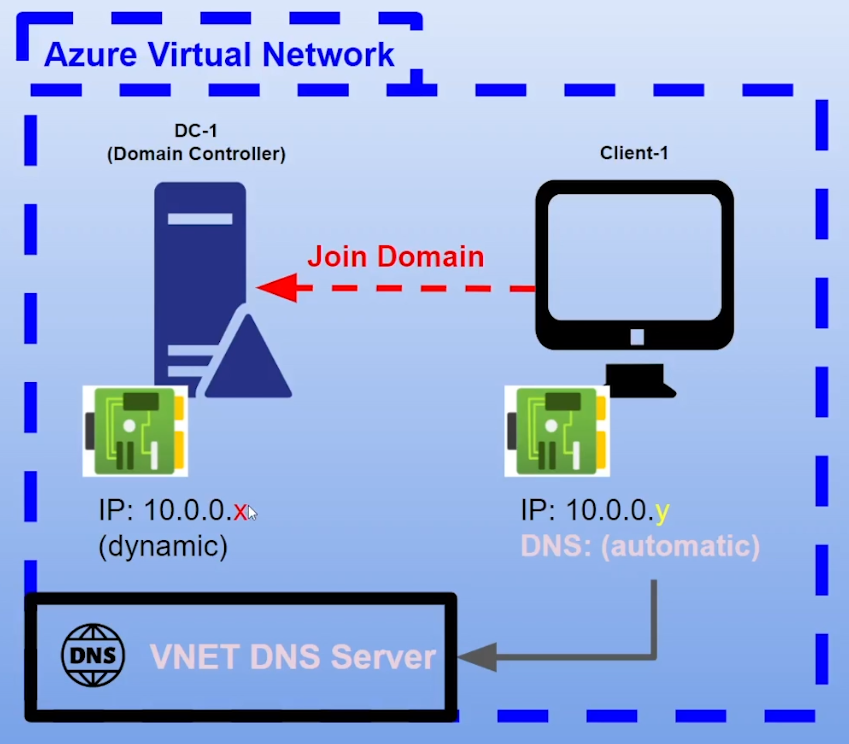
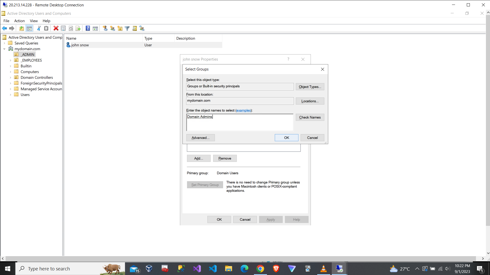
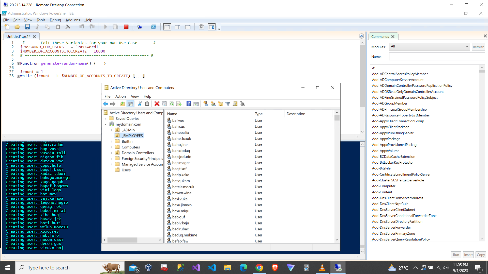

# On-premises Active Directory and Client PC Deployed in the Cloud (Azure)

## Intro

This project outlines the implementation of 2 Azure virtual machines (on-premises Active Directory and client PC).

## Tech used

### Operating Systems

- Windows Server 2022
- Windows 10

### Platform and Software

- Azure portal (Resource Groups, Virtual Machines, Network Interface, Network Security Group)
- Remote Desktop Connection
- Active Directory Domain Services
- PowerShell

## Overview

## Configuration Steps
###### top
- [Step 1: Create resources](#step-1-create-resources)
- [Step 2: Establish connectivity to between Domain Controller and Client](#step-2-establish-connectivity-to-between-domain-controller-and-client)
- [Step 3: Install Active Directory](#step-3-install-active-directory)
- [Step 4: Create an administrator and regular account in Active Directory](#step-4-create-an-administrator-and-regular-account-in-active-directory)
- [Step 5: Join Client to the Domain Controller](#step-5-join-client-to-the-domain-controller)
- [Step 6: Setup Remote Desktop for non-administrative users to Client](#step-6-setup-remote-desktop-for-non-administrative-users-to-client)
- [Step 7: Create users in Active Directory using Powershell script](#step-7-create-users-in-active-directory-using-powershell-script)
- [Bonus Step: How to unlock users' accounts and reset passwords](#bonus-step-how-to-unlock-users-accounts-and-reset-passwords)

### Step 1: Create resources

Create Resource Group

- it's treat as your each department (IT, HR etc.) so that yu can keep track their expenses

Create Azure Virtual Machines and Virtual Network

- Create the ***domain controller*** virtual machine (VM) which is Windows Server 2022 (DC-1).
- Create the ***client*** VM which is Windows 10 (Client-1).
- After creation of DC-1, virtual network (VN) is created as well. So let Client-1 select the VN of DC-1 thus ***both VM under the same VN***. 
- Set up the ***login*** by using username and password of both VMs for remote desktop connection in step 2.
- Set the NIC private IP address of DC-1 to be ***static***from default setting as shown below. We don't want it to change at all if not the random assignation of DHCP will occur. Later we will set the DNS IP address of Client-1 to use ***DC-1 IP address as DNS server*** instead of VN DNS server in step 5.

### Step 2: Establish connectivity to between Domain Controller and Client
[back to top](#top)

- Login to DC-1 and Client-1 by using ***public IP address*** with credentials (username and password)
- ***Ping private IP address*** of DC-1 with -t but it seems blocked by DC-1. Next we login to DC-1 and ***enable ICMPv4*** then we ping again.

### Step 3: Install Active Directory
[back to top](#top)

- Login to DC-1 -> Server Manager -> Add Roles and Features -> tick Active Directory Domain Services -> click ***Promote this server to a domain controller*** -> Add a new forest -> name it mydomain.com -> set DSRM password -> restart -> reconnect -> login with mydomain.com\labuser

### Step 4: Create an administrator and regular account in Active Directory
[back to top](#top)

Create 2 ***new Organisation Unit (OU)***

- Server Manager -> Tools -> Active Directory Users and Computers (ADUC) -> right click mydomain.com -> new -> organisation unit -> name it _ADMIN and _EMPLOYEES

Create ***new employee*** "john_admin" and add to "Domain Admins" Security Group

- Go to _ADMIN -> right click black space -> new -> User -> fill in first name, last name, user login name -> right click created user -> properties -> Member Of -> Add -> type domain admins -> Check Names -> OK -> log off -> reconnect -> login with mydomain.com\john_admin

### Step 5: Join Client to the Domain Controller
[back to top](#top)

- Client-1 ***cannot find mydomain.com*** in default DNS server due to not connected to private IP address 10.0.0.4 (DC-1) as DNS server that shown in step 1.

- ***Change DNS server*** setting (Client-1) in Azure portal

- Log off -> reconnect -> shortcut (win+r) -> type cmd -> check status

- Shortcut (win+x) / right click start menu icon -> System -> Rename this PC (advanced) -> Computer Name -> Change -> pick Domain -> type mydomain.com -> OK -> enter mydomain.com\john_admin

### Step 6: Setup Remote Desktop for non-administrative users to Client
[back to top](#top)

Allow "Domain Users" access to remote desktop, ***every user can log in into Client-1*** as normal/non-administrative user

- Shortcut (win+x) / right click start menu icon -> System -> Remote desktop -> Select users that can remotely access this PC -> Add -> type domain users -> Check Names -> OK

Double check who is in "Domain Users" Security Group in DC-1

- (Server Manager -> Tools -> ADUC) / (Start menu -> Windows Administrative Tools -> ADUC) -> mydomain.com -> Users -> double click Domain Users -> Members 

### Step 7: Create users in Active Directory using Powershell script
[back to top](#top)

- Login to DC-1 as john_admin
- Open PowerShell_ise as an administrator
- Create a new File and paste content of the [script](https://github.com/joshmadakor1/AD_PS/blob/master/Generate-Names-Create-Users.ps1) into it -> F5 / Play button -> ADUC -> _EMPLOYEES -> right click _EMPLOYEES -> refresh
- Pick one auto-generated user to login to Client-1

### Bonus Step: How to unlock users' accounts and reset passwords
[back to top](#top)
- Login user with wrong password few times to make it locked

- Right click the user's name -> Reset Password

- Right click the user'name -> Properties -> tick Unlock account

 
:warning:Last but not least, please don't forget to clean up your Azure resource groups as ***you can incur charges*** that use up your $200 free credits!

## Credits
[back to top](#top)

- [Josh Madakor](https://github.com/joshmadakor1)