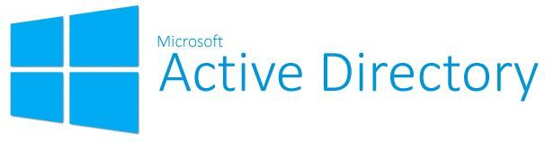

# On-premises Active Directory and Client PC Deployed in the Cloud (Azure)

## Intro

This home lab outlines the implementation of 2 Azure virtual machines (on-premises Active Directory and client PC).

## Tech used

**Operating Systems**

- Windows Server 2022
- Windows 10 (21H2)

**Platform and Software**

- Azure (Resource Groups, Virtual Machines, Network Interface, Network Security Group)
- Remote Desktop Connection
- Active Directory Domain Services
- PowerShell

## Overview

